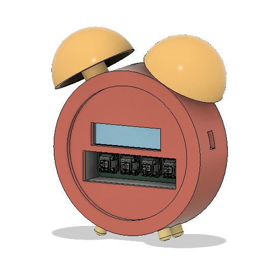
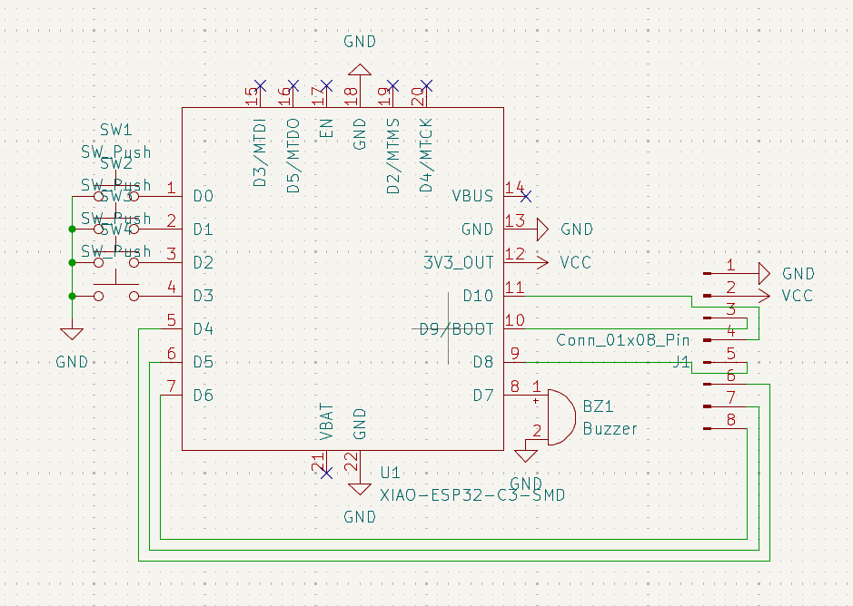

# HollowAlarm

    HollowAlarm was my ship for the Blare Mission of Stardance Hackclub
    HollowAlarm features a simple clock like shape design with 4 keys to control

# Features:

    - 2.25 Inch TFT Display
    - 4 Keys
    - Buzzer... cuz its and alarm

# CAD Model:

    HollowPad is divided in 4 parts.
    - the main shell where eveything connects that include a sorta of cabinet design and dovetail joints to connect to the shell of the alarm.
    - The shell itself consisting of the front piece and back piece to close the clock design

    Everything was in Fusion cuz its lowk fire

# PCB
    It was made in KiCad. Only requiring extra footprints ansd symbols provided by the Blare page!

    The footprints for the Switches are standart MX style Switches!

**Schematic:**

**PCB Layout:**

    Also it has a lot of small silkscreens cuz they lowk cool!

# Firmware Overview
    The firmware can be described as spaghetti code secured by hopes and dreams.
    It gives each button its own function and has a way to swap between 4 background which I made! More can be added by changing the background.h file on the firmware

 

# BOM:
    Here should be everything you need to make this hackpad

    - 4x Cherry MX Switches
    - 4x DSA Keycaps (or you can make some if u want)
    - 1x Buzzer
    - 1x 2.25" 284x76 TFT Display
    - 1x XIAO ESP32C3
    - 1x Case (4 Printed Parts)

# Extra stuff
    To anyone that is reading the end of this READ ME i wana say thanks for atleast checking out my project.
    With that thanks again and Good Luck on your projects!!!